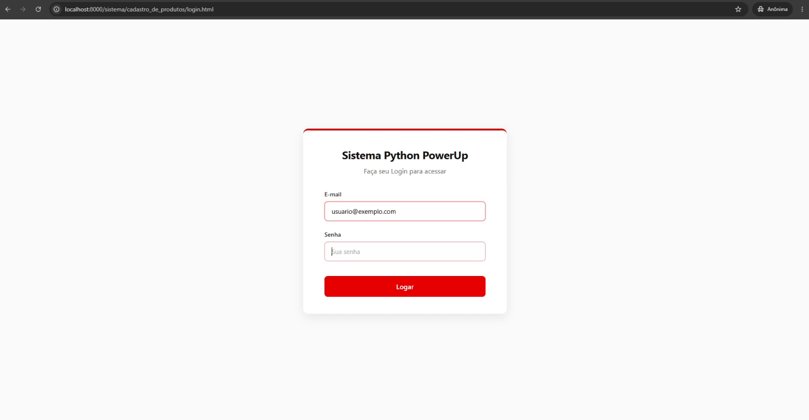
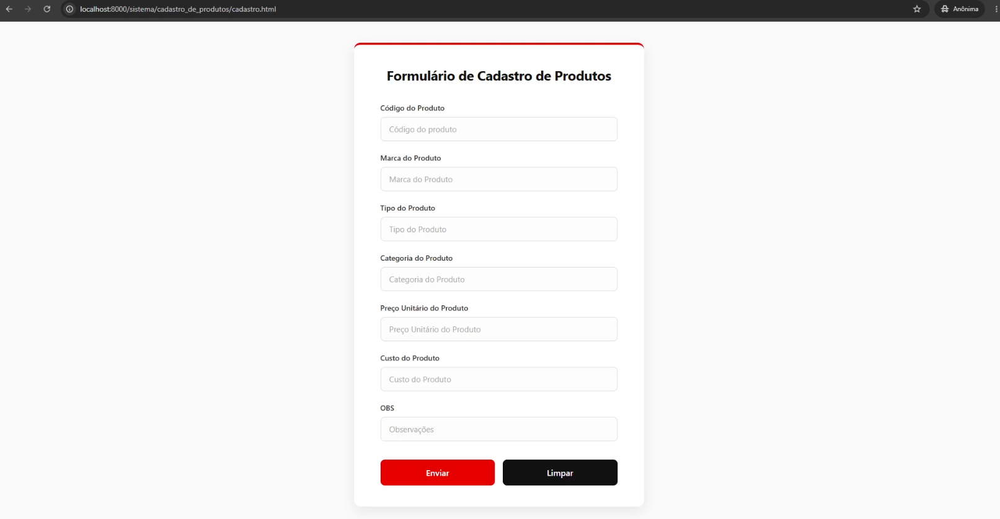

### RPA — Cadastro de Produtos

Ferramenta de automação de interface que elimina o trabalho manual de cadastro em sistemas ERP legados.
Lê uma planilha `.csv`, abre o navegador, realiza o login e preenche os campos automaticamente — sem API, sem integração, zero intervenção humana.


### O problema que resolve
 
Sistemas corporativos antigos frequentemente não oferecem importação em massa nem integração via API. Isso obriga funcionários a passarem horas cadastrando produtos manualmente, gerando alto custo operacional e risco constante de erro humano.


### Como funciona
 
1. O usuário deposita o arquivo `.csv` na pasta `Entrada/`
2. Executa o robô clicando duas vezes em `INICIAR.bat`
3. O robô abre o Chrome, faz login e preenche todos os campos automaticamente
4. Ao finalizar, o arquivo `.csv` é movido para `Processados/` — impedindo reprocessamento acidental

### Demonstração

Login do sistema:


Painel de cadastro de produtos:


GIF da automação rodando:


### Estrutura de entrega ao cliente

O cliente recebe exclusivamente a pasta `dist/`:

```
dist/
├── INICIAR.bat                     <- ponto de entrada do sistema
├── rpa-cadastro-de-produtos.exe
├── Entrada/                        <- depositar o .csv aqui
└── Processados/                    <- arquivos processados ficam aqui
```

O executável é autossuficiente. Nenhuma instalação de Python ou dependências é necessária na máquina do cliente.


### Configuracao inicial (primeira execucao)
 
Na primeira execução, o sistema detecta que não há configuração salva e abre o setup automaticamente:
 
```
Primeira execucao detectada! Vamos configurar suas credenciais.
 
Setup de Credenciais
   E-mail: usuario@empresa.com
   Senha:  ********
   URL do sistema (ex: http://erp.empresa.com): http://sistema.empresa.com/login
Credenciais salvas em config.json
```
 
As credenciais ficam salvas localmente em `config.json`, ao lado do executável.
Para reconfigurar, use a opção `[2]` do menu principal.
 


### Menu principal
 
```
+---------------------------------------+
|           Menu Principal              |
|                                       |
|   RPA - Cadastro de Produtos          |
|                                       |
|    [1] Iniciar Cadastro               |
|    [2] Configurar Credenciais         |
|    [3] Gerenciar Senha de Acesso      |
|    [4] Sair                           |
+---------------------------------------+
Escolha uma opcao:
```
 
#### Opcao 1 — Iniciar Cadastro
 
Inicia o processo de automação. Se uma senha de acesso estiver configurada, ela será solicitada antes de prosseguir.
 
O sistema busca todos os arquivos `.csv` dentro da pasta `Entrada/` e os processa em sequência, exibindo o progresso em tempo real:
 
```
1 arquivo(s) encontrado(s):
  [1] produtos_novos.csv
 
  Processando: produtos_novos.csv
  -> Produto 1/50: MOL000251 | Logitech
  -> Produto 2/50: MOL000192 | Logitech
  -> Produto 3/50: MOL000151 | Multilaser
  Cadastrando produtos... ████████░░░░  60%
```
 
#### Opcao 2 — Configurar Credenciais
 
Permite alterar e-mail, senha e URL do sistema a qualquer momento, sem precisar recriar o arquivo de configuração.
 
#### Opcao 3 — Gerenciar Senha de Acesso
 
Controla o acesso à automação:
 
- **Sem senha configurada:** oferece definir uma nova senha
- **Com senha configurada:** solicita a senha atual antes de permitir troca ou remoção
A senha é armazenada como hash SHA-256 — nunca em texto puro.
 
#### Opcao 4 — Sair
 
Encerra o programa normalmente.
 

### Formato do arquivo CSV
 
O arquivo `.csv` deve conter as seguintes colunas, nesta ordem:
 
| codigo | marca | tipo | categoria | preco_unitario | custo | obs |
|---|---|---|---|---|---|---|
| MOL000251 | Logitech | Mouse | Perifericos | 189.90 | 56.97 | |
| TELO000131 | Logitech | Teclado | Perifericos | 299.90 | 89.97 | Produto fragil |
 
A coluna `obs` e opcional. Células vazias são ignoradas automaticamente.
 


### Como parar a automação
 
Feche a janela do terminal (CMD) durante a execução. O processo é encerrado imediatamente.
 
O arquivo `.csv` permanece na pasta `Entrada/` e o progresso até o momento é salvo automaticamente. Nenhum produto será reprocessado na próxima execução.
 


### Recurso de retomada automatica
 
Se a execução for interrompida no meio do processamento — seja por fechamento do terminal, erro de rede ou qualquer outro motivo — o sistema detecta o ponto de parada na próxima execução e oferece opções de continuidade:
 
```
Execucao anterior interrompida!
   Arquivo  : produtos_novos.csv
   Progresso: 23 de 50 produtos
   Data     : 30/05/2026 14:35:12
 
 [1] Continuar de onde parou
 [2] Recomecaar do inicio
 [3] Cancelar
```
 
<!-- Insira aqui um print ou GIF desta tela para ilustrar -->
 
Ao escolher `[1]`, o robô pula os 23 produtos já cadastrados e retoma a partir do produto 24, eliminando o risco de duplicidade.
 

 
### Recuperação de acesso
 
Caso o operador esqueça a senha de acesso configurada na opção `[3]`, o procedimento de recuperação é:
 
1. Localizar o arquivo `config.json` na mesma pasta do executável
2. Excluir o arquivo
3. Executar o robô novamente — o setup será reiniciado do zero
**Atenção:** a exclusão do `config.json` apaga também as credenciais do sistema (e-mail, senha, URL). Elas precisarão ser reconfiguradas.
 

 
### Adaptando para outro sistema
 
Para utilizar o robô em um ERP diferente, apenas um trecho precisa ser alterado:
 
**`src/bot.py` — funcao `_preencher_linha()`**
 
```python
# Ajuste a lista para refletir a ordem dos campos na tela do novo sistema
campos = ['codigo', 'marca', 'tipo', 'categoria', 'preco_unitario', 'custo']
```
 
Os arquivos `main.py` e `config.py` não precisam ser tocados.
 

 
### Stack tecnica
 
| Tecnologia | Funcao |
|---|---|
| Python 3.14 | Linguagem base |
| pyautogui | Automacao de teclado e mouse |
| pandas | Leitura e manipulacao do CSV |
| rich | Interface de terminal com barra de progresso |
| PyInstaller | Empacotamento em .exe autossuficiente |
| uv | Gerenciamento de dependencias |
 

 
### Arquitetura do projeto
 
**Codigo-fonte (repositorio):**
 
```
rpa_cadastro_de_produtos/
├── dist/           ← gitignored
├── img/
├── src/
│   ├── bot.py
│   ├── config.py
│   └── main.py
├── .gitignore
├── .python-version
├── LICENSE
├── pyproject.toml
├── README.md
├── rpa-cadastro-de-...spec   ← gitignored (*.spec)
└── uv.lock
```
 
**Entrega ao cliente:**
 
```
dist/
+-- rpa-cadastro-de-produtos.exe  -> executavel do sistema
+-- INICIAR.bat                   -> ponto de entrada recomendado
+-- Entrada/                      -> cliente deposita os CSVs aqui
+-- Processados/                  -> robo move os CSVs para ca apos concluir
+-- config.json                   -> gerado automaticamente na primeira execucao
```
 

 
### Rodando em desenvolvimento
 
```powershell
# Instala as dependencias
uv sync
 
# Executa sem compilar o .exe
uv run python src/main.py
```
 
### Gerando o executavel
 
```powershell
uv run pyinstaller --onefile --console --name "rpa-cadastro-de-produtos" src/main.py
 
# Cria as pastas de entrega ao lado do .exe
mkdir dist\Entrada
mkdir dist\Processados
```
 

 
### Requisitos da maquina do cliente
 
- Windows 10 ou superior
- Google Chrome instalado
- Nenhuma instalacao de Python ou bibliotecas adicionais

 
### Licenca
 
MIT
